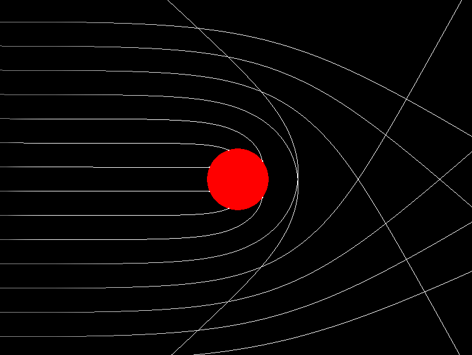
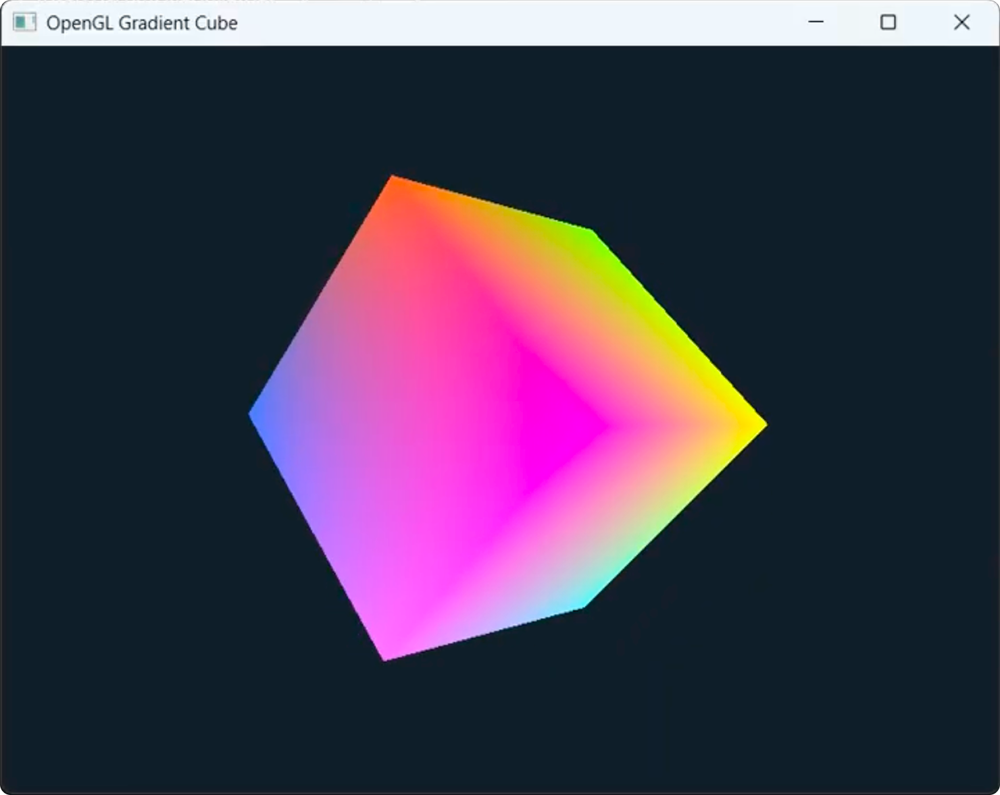

# About The Project

This project explored 2D and 3D graphics rendering using OpenGL,
GLEW, GLFW, and GLM. The team worked through the fundamentals —
window creation, error checking, vertex arrays, indices, and
shaders - then put it all together in a black hole simulation.

## Learning Progression

The team built up their knowledge step by step. They started with
OpenGL basics: GLFW for creating windows and handling inputs, GLEW
for accessing modern OpenGL features without manually managing
function pointers, and GLM for vector and matrix math. From there,
they moved through window creation, error checking, and window
pointer definitions before tackling the actual rendering.

## Black Hole Simulation

The black hole is constructed using OpenGL triangles. Its
constructor calculates the Schwarzschild radius based on the
black hole's mass, which determines the event horizon - the point
where light can no longer escape. Light rays are rendered as
points with fading trails connected by GL Line Strips, and their
paths are computed using geodesic equations.

The team implemented both Euler's method and RK4 (Runge-Kutta 4th
order) step functions to simulate how light curves around the
black hole. Polar coordinates are converted back to cartesian for
rendering. The final product shows both single and multiple light
rays bending around the event horizon.

## Shaders and 3D Objects

Beyond the simulation, the team also built 2D and 3D shader
objects using vertex and indices arrays. The vertex array defines
the object being drawn - each vertex contains 3D coordinates and
a color attribute. The indices array specifies the order vertices
should be processed to form triangles on screen.

