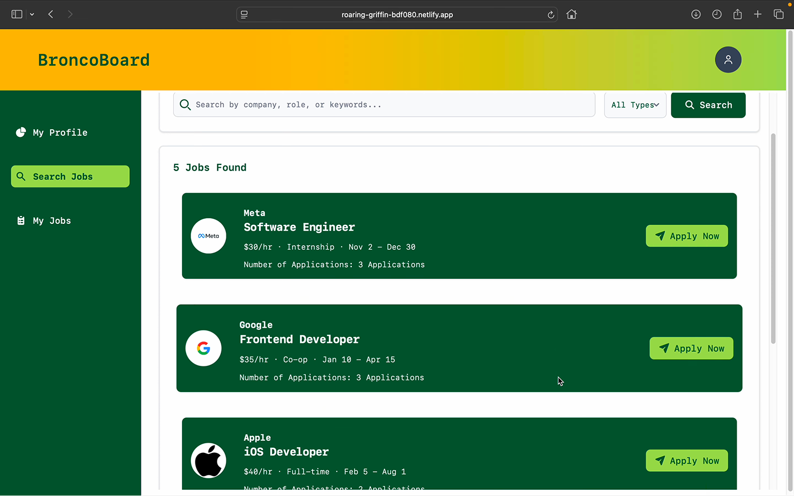

# About The Project

Broncoboard is a job board built specifically for Cal Poly Pomona
students. The app helps students and employers connect by listing
positions with key details - role, pay rate, employment type, and
application deadlines - so students can quickly find opportunities
that fit their schedule and skills.

## Goals

The team had three main objectives: learn by putting skills into
practice on a real-world project, build a polished frontend UI
using HTML, CSS, JavaScript, and Tailwind, and build a backend API
with Node.js, Express, and MySQL that could interact with the
frontend.

## What The Team Built

On the frontend, the team built a main page with job previews,
login and signup pages, and a recruiter management portal where
employers can post new jobs, review applicants, and take actions
like rejecting, requesting interviews, or accepting candidates
with notes. They also built a candidates portal where users can
search for jobs, apply, cancel applications, and track their
application status.

The backend was the team's biggest challenge. Due to time
constraints and the learning curve around Node.js, Express, and
MySQL, they weren't able to fully complete the backend - but the
frontend was deployed and functional.

## What The Team Learned

The team learned Git and GitHub for version control and project
organization, Tailwind CSS for building frontend UI, and improved
their core HTML/CSS/JS skills. They also learned lessons about
time management - balancing school work with side projects - and
team collaboration. These are things they plan to carry into
future projects.

