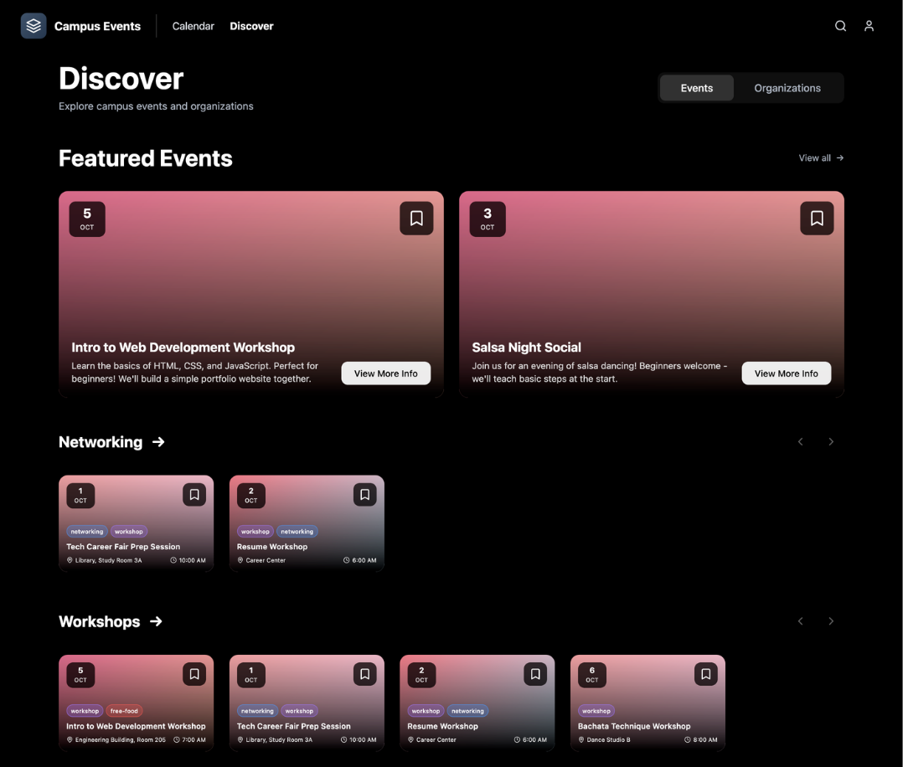

# About The Project

Campus Events App takes a fresh approach to how students discover
what's happening at Cal Poly Pomona. The team set out to reimagine
what MyBar could be - a better way to explore campus events, clubs,
and opportunities all in one place.

The app features a clean interface with sections for discovering
events and browsing organizations on campus. The team focused on
making navigation intuitive, so students can quickly find what
they're looking for without digging through multiple platforms.

## The Problem

The existing myBAR platform had a cluttered design with too much
text upfront, no calendar integration, inconvenient navigation,
outdated organizations and events that stayed displayed, and no
dark mode. The team set out to fix all of that.

## Process

The team started in Figma, drafting out pages and brainstorming
different versions of the UI. They moved elements around to test
ideas, then finalized which designs to actually build. This
prototyping phase was key - it let the team iterate quickly before
writing any code.

On the frontend, the team used SvelteKit 5 with Shadcn UI
components and Tailwind CSS, building reusable components for each
page. On the backend, they set up SvelteKit server-side routing
with API endpoints, Supabase for auth and a Postgres database, and
Drizzle ORM for typed schemas, migrations, and queries.

## What The Team Learned

- **Figma prototyping** - drafting pages, testing layouts, and
  finalizing designs before coding
- **Svelte** - file-based components, layouts and routing,
  integration with APIs and Supabase, deploying via Vercel
- **Supabase** - PostgreSQL basics, data storage, API routes with
  the Supabase client, and how auth works
- **GitHub** - branching for collaboration, rebasing to sync with
  main, pull requests for reviews, resolving merge conflicts, and
  commit history tracking

## Future Additions

Calendar integration, admin tools for managing events and orgs,
OAuth sign-in, user dashboards for tracking involvement, site
theming, and potentially connecting to the CPP database.

