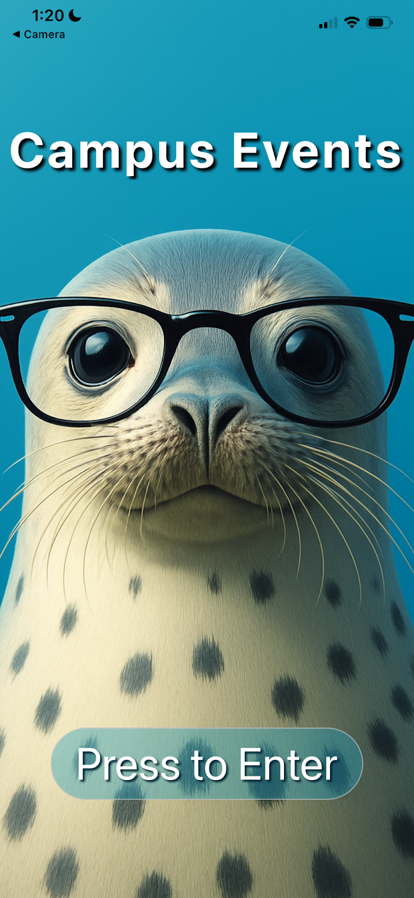
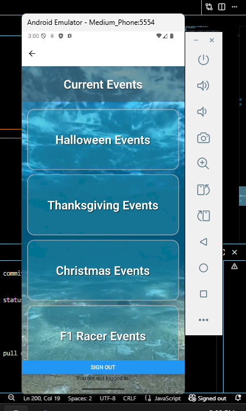
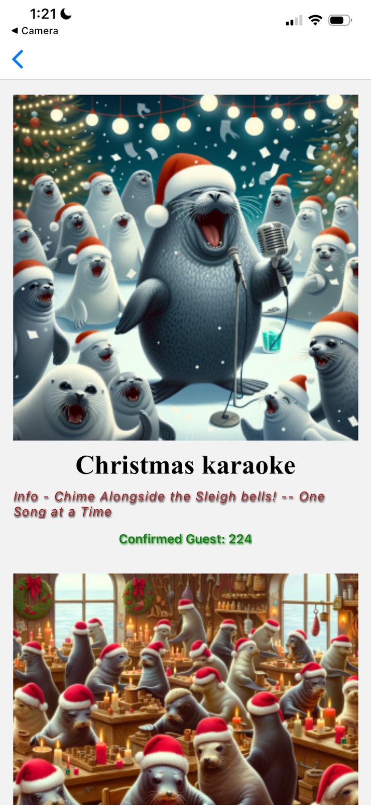

# About The Project

Campus Events Mobile was built to solve a common problem: students
missing out on things happening around campus simply because they
didn't know about them. The app lists a wide variety of seasonal
events and gives users the info they need to decide if they want
to go - including dates, descriptions, and attendance numbers.

The team designed and built the app from scratch, starting with
wireframes to map out the layout and color palette, then moving
into full development. The app features a splash screen with Sir
Seals-a-Lot (the mascot), a Supabase-powered login system, and a
directory of event categories like holidays, sports, and activities.

Each event screen follows a consistent structure: an image of the
event, its title and description, and a live count of attendees to
encourage participation. The team also built a settings screen that
lets users customize button styles, animations, background colors,
and fonts - all resettable to defaults.

## Process

The team started by building wireframes to nail down the general
direction of the app - simple screen layouts and a color palette
that felt welcoming without being overwhelming. From there, they
moved into development, iterating on each screen one at a time.

A key design decision was keeping all event screens structurally
identical. Whether it was Christmas, F1 Racing, or Sports, every
screen used the same layout: image, title, description, and
attendee count. This consistency made the app easy to pick up and
use without a learning curve.

The team also explored AI image generation as a tool for creating
temporary placeholder assets during development, with plans to
use the same technology to improve accessibility and navigation
in future versions.

