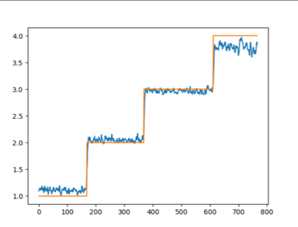
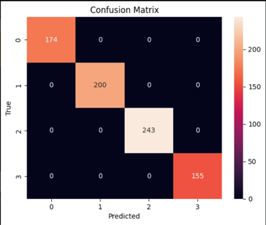
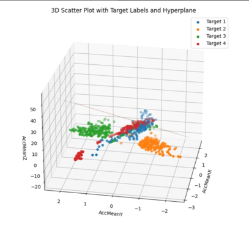

# About The Project

The HTGR project aims to provide members an introduction into
machine learning. The HTGR team designed and developed several
machine learning models including Random Forest, SVM, And LSTM
models predicting sudden driving behavior.

- LSTM models use sequential data passed through memory cells to
  decide which information to forget and which to save as it moves
  to the next cell.
- Random forest models use random subsets of data labels and
  random feature sets to create multiple decision trees. Each tree
  is branched through various conditions, which might involve
  comparing data set values like mean acceleration, to certain
  thresholds.
- SVM models use a hyperplane of data, using the confidence level
  of the data point to create a binary classification scenario,
  which with high confidence could be very useful.

Using these 3 models, a broad yet highly accurate range was cast by
splitting the data up into 3 groups. The project wrapped up with
higher than 90% accuracy for all 3 models. To learn more about each
model in depth, we highly recommend checking out the GitHub repo to
learn more about each of them through the summed up powerpoint
presentations on there about Machine Learning basics and details
about each type of the Models we worked on.

