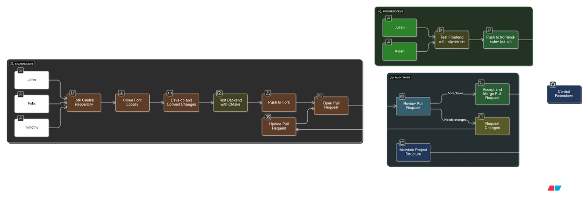

# About The Project

This project started with a question: what actually happens between
a server and a client when you visit a website? To find out, the
team built an HTTP server from scratch in C - no frameworks, no
hand-holding, zero batteries included.

The server implements the full client-server request-response model
with multi-threaded support, allowing simultaneous connections
without blocking. On the frontend, the team built an interactive
web page serving educational resources using HTML, CSS, JavaScript,
and the Bootstrap toolkit.

## What The Team Learned

The project was designed as a learning experience from the ground
up. On the backend side, members got hands-on with C - one of the
most important programming languages ever written, and the
foundation behind Python, Lua, Git, and most operating systems.
Topics like memory management and pointers, which can feel
intimidating in a classroom, became real through building
something that worked.

On the frontend, the team picked up HTML, CSS, and JavaScript
alongside the Bootstrap toolkit, one of the most widely used
tools for accelerated front-end development.

## Challenges

The biggest hurdle was maintaining code quality across an
asynchronous team. Working together virtually is hard enough —
doing it asynchronously is harder. The solution was Git and GitHub.
Backend code went through reviews before merging, while frontend
developers had direct read/write access to the remote repository.
This workflow kept the codebase clean and collaboration smooth.

## Next Steps

Given more time, the team would have added server-side
authentication via an API, a connection to a remote database for
persistent storage, and cookie logging for personalized user
experiences.

