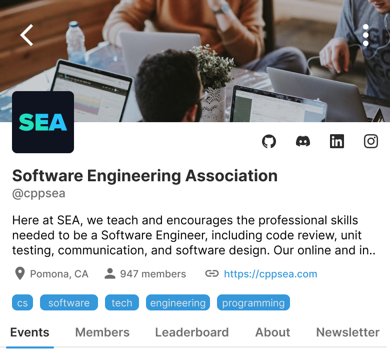
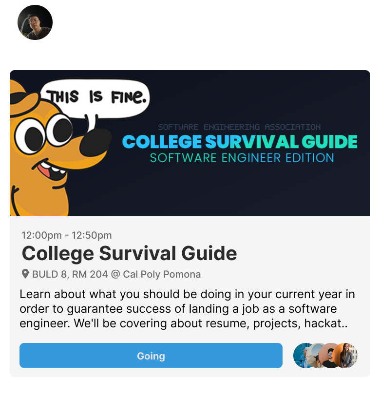

# About The Project

Icebreak is SEA's platform to connect school organizations with their
members. Icebreak aims to be the central hub for members to remain
updated on current organization events. To create this application,
our team worked with React Native, a mobile friendly version of
React.js for the frontend. For the backend, Express.js was used as our
framework, and for the database, services like PostgreSQL and Prism
ORM (Object-relational mapping).

Using these technologies, Icebreak is able to function as a CRUD
application, and uses JSON Web Tokens as a means of signing into the
application. Future plans for Icebreak include the Guilds feature
being fully implemented, aka the basis of each club and organization.

