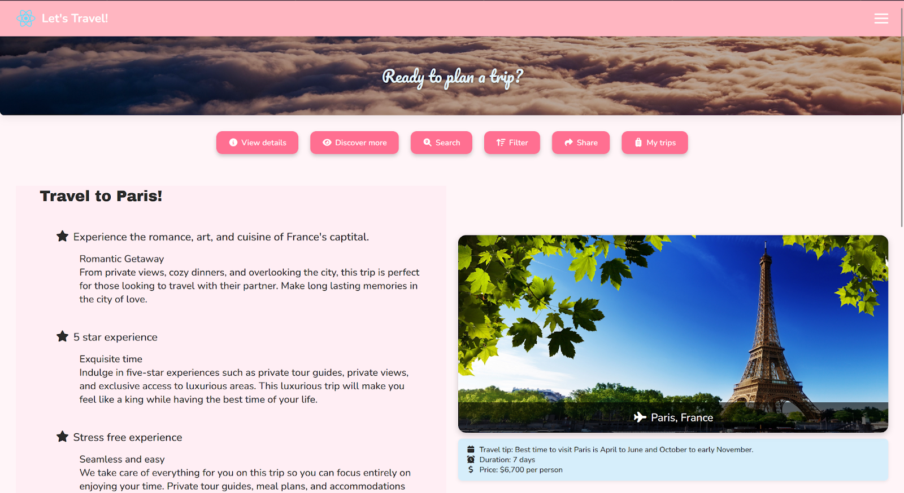
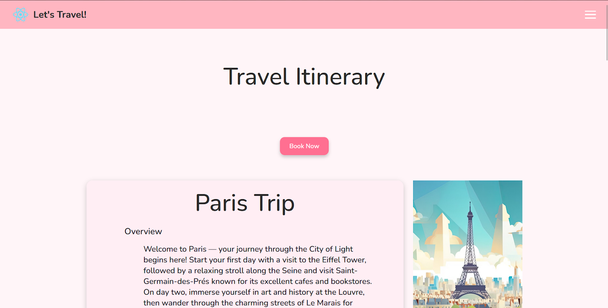
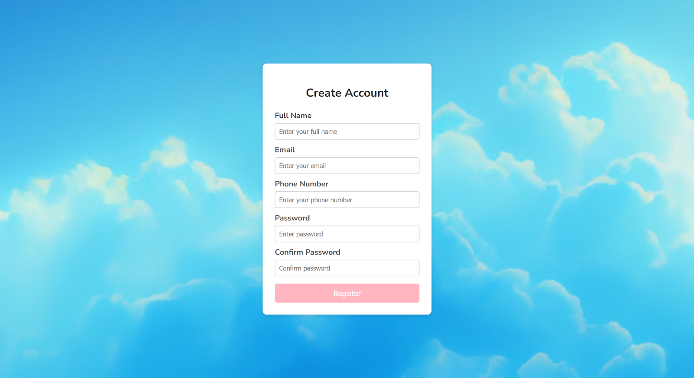

# About The Project

Let's Travel is a collaborative travel planner built for groups —
families, friends, student trips, and solo travelers too. The goal
was to make group travel planning easier by putting discovery,
itineraries, and navigation all in one place.

The frontend team built trip cards that showcase highlights and
top activities, along with a navigation system that guides users
through the app's main sections. The UI includes a registration
flow, login page, and an itinerary view that breaks trips down
day by day with attractions and places to visit.

On the backend, the team built REST APIs powered by PostgreSQL.
The Trips API handles creation and retrieval of trip records with
full CRUD support. A Weather API proxies requests to OpenWeatherMap,
delivering real-time weather data based on city queries so travelers
can plan around conditions.

## Team Structure

The project split into two main tracks. Jared led as project
manager while also managing the whole project and leading frontend.
Arriana led backend development and API integration, and was set
to be the next project manager. The frontend and API team built the
website interface, integrated external APIs for maps, events,
weather, and currency, and ensured a smooth user experience. The
backend team built REST APIs, designed and managed the database,
and handled authentication and data security.

## UI/UX Design

Each part of the interface was designed with a specific purpose.
Trip cards showcase highlights and top activities to spark
excitement. Navigation buttons provide clear pathways to main
sections - view details, discover more, search, filter, share,
and access saved trips. The itinerary view breaks trips down day
by day with attractions and places to visit, plus an easy booking
option.

